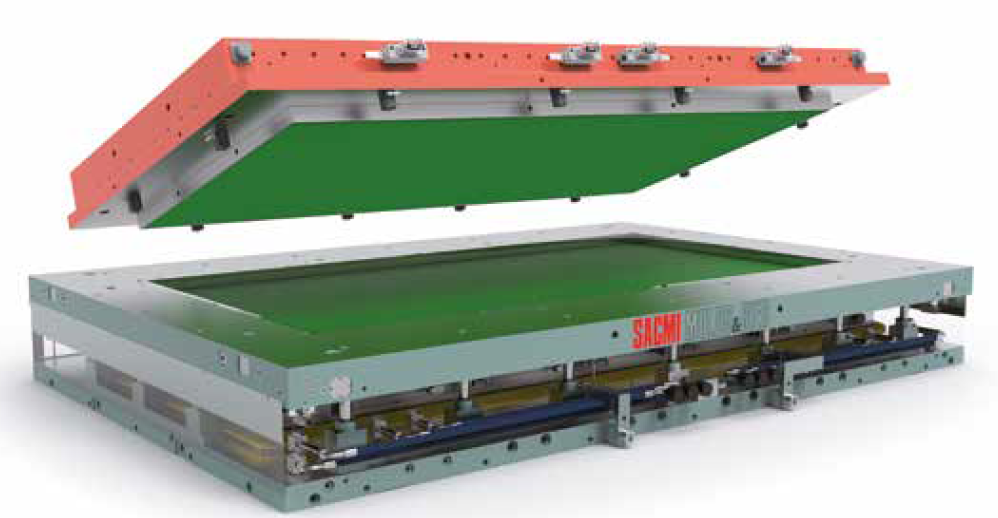
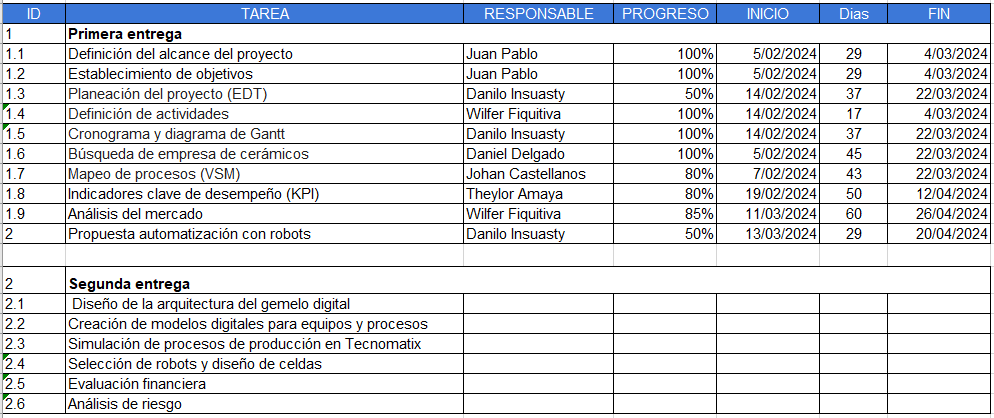
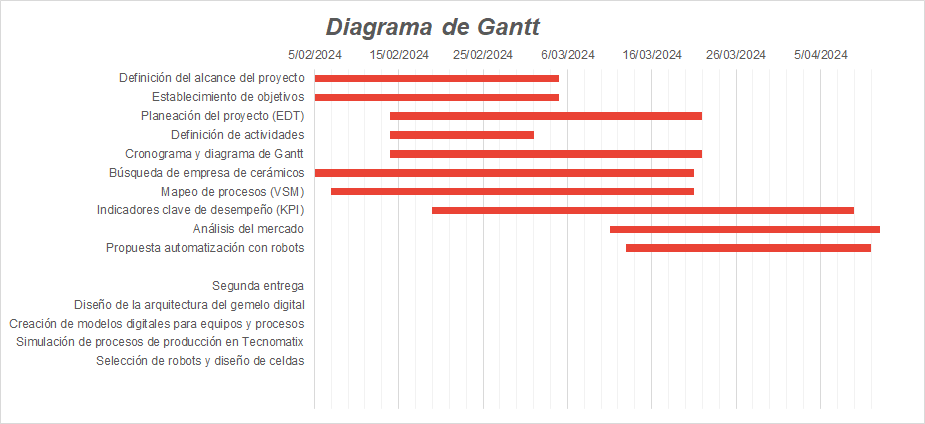

# Tecnomotion - Equipo del Curso de Automatización de Procesos de Manufactura

Somos Tecnomotion, un equipo a cargo del curso de Automatización de Procesos de Manufactura de la Universidad Nacional de Colombia en el semestre 2024-1. Estamos integrados por:

- Theylor Andrés Amaya Villabon
- Juan Pablo Cárdenas Higuera
- Johan Leonardo Castellanos Ruiz
- Daniel Alejandro Delgado Arcila
- Wilfer Armando Fiquitiva Mendez
- Danilo Enrique Insuasty Delgado

## Descripción del Proyecto
## Planta de producción de baldosa cerámica TECNOMOTION.
El desarrollo de la construcción ha sido una necesidad primordial para la humanidad, ya que implica la creación de espacios para llevar a cabo actividades cotidianas como trabajar, estudiar y vivir. Estos espacios deben estar diseñados de manera adecuada para proporcionar comodidad y condiciones óptimas para cada función específica. Por ello, la fabricación de cerámica ofrece una amplia gama de productos que no solo añaden armonía y belleza a los ambientes, sino que también proporcionan propiedades específicas de durabilidad y resistencia, adaptadas a las condiciones de uso, ya sea en interiores o exteriores, así como en entornos residenciales o industriales. Esto implica directamente la resistencia al desgaste y a la humedad.
Teniendo en cuenta lo anterior, se definen tres líneas principales de productos a producir, que son:

## •	Piso cerámico de interiores 60x60 cm:

Ancho: 60 cm 

Espesor: 8.3 mm

Largo: 60 cm

Peso: 17.5 kg

Especificaciones

Tipo: Pisos cerámicos

Acabado: revestimiento: Satín

Antideslizante / Uso en duchas: No apto para zonas húmedas y duchas

Apariencia: Maderadas

Coeficiente de fricción DCOF: Clase 1 menor o igual a 0,42

Color: Terracota

Color referencial: Café/Marrón.

Compatible con suelo radiante: No

Dilatación de junta:3 mm

Material: Cerámica

Número de caras: 4

Número de piezas: 5

País de Origen: Colombia

Rendimiento por caja: 1.8 m2

Resistencia al agua: Si

Resistencia al congelamiento: No

Resistencia al desgaste: PEI III (Tránsito medio)

Resistencia al tráfico: Residencial

Textura de superficie: Liso

Tipo de borde: No Rectificado

Ubicación: Local comercial;Oficina;Zona social

Uso de revestimiento: Piso

Normas de Fabricación: NTC 4321

## •	Piso pared cerámico de interiores 60x31cm:

.

Dimensiones: Ancho:31 cm, espesor:8.4 mm largo:60 cm

Peso: 27.50 kg

Especificaciones:
Tipo: Pisos cerámicos

Acabado revestimiento:Mate

Ambiente: Interior

Antideslizante / Uso en duchas: No apto para zonas húmedas y duchas

Apariencia: Rústicas

Coeficiente de fricción DCOF: Clase 1 menor o igual a 0,42

Color:Beige

Compatible con suelo radiante:No

Cuenta con biselado: No

Dilatación de junta: 4 mm

Espacio recomendado:Baño;Cocina;Comedor;Dormitorio;Oficina;Sala Estar.

Forma del revestimiento:Rectangular

Formato del producto:Caja

Material: Cerámica

Número de piezas: 9

Rendimiento por caja:1.68 cm2

Resistencia al agua: Si

Resistencia al congelamiento: No 

Resistencia al desgaste: PEI III (Tránsito medio)

Resistencia al tráfico: Medio

Resistencia al tráfico: Comercial Moderado.

Textura de superficie:Texturizado

Tipo de borde:No Rectificado

Tipo de losa: Cerámica tipo marmolada

Tipo de revestimiento:Cerámica

Uso de revestimiento: Piso y muro

Estilo deco: Clásico

Modelo: Laja.

Normas de Fabricación: NTC 919 e ISO 13006

Cantidad contenida en el empaque:9 unidad(es)

## •	Piso porcelanico interiores y exteriores 45x45.

.

Dimensiones: 45 x 45 cm.

Espesor: 0.85 cm

Peso: 20.8 kg

Especificaciones:

Tipo: Gres Porcelánico.

Acabado revestimiento: Mate

Adhesivo recomendado: Adhesivo porcelanato

Ambiente: Interior;Exterior.

Apariencia: Rústicas.

Aplicación:Interior y exterior.

Caras por empaque: 7

Coeficiente de fricción DCOF: Exterior húmedo mayor o igual a 0,55 wet.

Color: Beige.

Compatible con suelo radiante:Si

Contenido: 7 unidad(es)

Cuenta con protección UV: Si

Esmaltado: Si

Espacio recomendado: Terrazas-Exterior;Cocina;Living;Sala Estar

Forma: Cuadrada

Forma del revestimiento: Cuadrada

Material: Gres Porcelánico.

Rendimiento por caja: 1.42 m2

Resistencia a la humedad: Alta

Resistencia a rayaduras: Si

Resistencia al desgaste: PEI IV (Tránsito alto)

Textura de superficie: Relieve.

Tipo de borde: No Rectificado

Tipo de revestimiento:Porcelanato

Ubicación: Exterior intemperie;Cocina;Zona social;Zona social.

Uso de revestimiento: Piso y muro.

Material: Gres Porcelánico.

Cantidad contenida en el empaque: 7 unidad(es)

Dimensiones producto empacado: 
45,2x45,4x6,3 cms

Con base en las especificaciones técnicas de las referencias previamente seleccionadas y mencionadas, debemos considerar que los pisos y revestimientos de paredes interiores se fabrican en cerámica. Por otro lado, el porcelanato es ideal tanto para exteriores como para interiores de alto tráfico. La selección de la prensa adecuada para la compactación de estos materiales es crucial, ya que constituye la referencia inicial para determinar la capacidad de producción de la línea, de acuerdo con la referencia que se esté fabricando. Esto se debe a que el gres porcelánico requiere un tiempo de prensado más prolongado y una presión más alta para lograr una mayor compactación, lo cual determina el nivel de impermeabilidad de la baldosa.

Al considerar las dimensiones de los productos y el material a prensar se procede a la selección de la prensa adecuada. Para ello, se emplea el catálogo de SACMI PH, una empresa especializada en la fabricación de prensas para el sector cerámico.

Tras analizar el catálogo y los productos a producir se identifica la prensa ideal teniendo en cuenta que nuestro formato máximo es de 60x60 cm. En el catálogo, encontramos la prensa PH8200 VELOCE (Figura 1), una máquina de última generación que ofrece una alta velocidad de prensado, alcanzando hasta 14 ciclos por minuto, con una fuerza de cierre de 8,200 KN y un clearance de 2,450 mm la cual nos permite prensar hasta dos baldosas or ciclo con un formato de 60x60 cm (consultar ficha técnica completa en el anexo 1).

.

###Figura 1 Troqueladora PH8200 SACMI.

En la tabla 1, se muestran las especificaciones técnicas de trabajo más relevantes. En ella, podemos evaluar la producción máxima de baldosas cerámicas, la cual corresponde a 28 baldosas por minuto, basada en dos baldosas por ciclo. Para el caso del gres porcelánico, debemos considerar que el proceso de prensado requiere un tiempo aproximadamente un 30% mayor. Esto se debe a que este producto necesita una mayor compactación y presión, lo que lo hace más resistente e impermeable debido a su textura más sólida.

.

###Tabla 1 Especificaciones de producción prensado.

Por otra parte, se plantea realizar el análisis de una línea de producción que nos permite fabricar las tres referencias de baldosas mencionadas. Para lograr esto, los equipos seleccionados permiten realizar cambios de herramientas específicos para cada referencia. En el caso del prensado, la prensa, gracias al clearance, ofrece la versatilidad de implementar moldes de diferentes tamaños con un diseño de punzón entrante (Figura 2). Esto permite la flexibilidad en el montaje de los productos, ya sea cara hacia arriba o cara hacia abajo, y agiliza el proceso.

.

###Figura 2 molde punzon entrante cortesia SACMI

## EDT 
Con el fin de conocer a fondo el proceso de producción de baldosas e identificar aquellas partes del proceso a mejorar y así optimizar la línea de producción se crea el EDT (Figura 3)orientado a la programación y entregables:

.

###Figura 3 EDT

En el cual se muestra el cronograma de actividades y responsables de cada una de las actividades en la primera fase de entrega el cual es como una fase investigativa y argumentativa del proceso de producción, que  nos lleva hacia la identificación de la estación de trabajo que mediante nuestra propuesta de valor se busca optimizar mediante la automatización del proceso.

.

###Figura 4 diagrama de Gantt.

En el diagrama de Gantt se muestra la trazabilidad cronológica del desarrollo de sus actividades desde la fecha de inicio hasta la fecha de entrega.

### Gestión de Producción y Automatización

- Análisis con el software de simulación de planta en donde se incorporen aspectos de fallas de equipos, disponibilidad, calidad, set-up, tiempos de producción, balance de líneas, colas, determinación de OEE, etc.
- Consideración de aspectos de pre-automatización, diagramas VSM pre y pos, aplicación de estrategias de pre-automatización.
- Propuesta de cómo llevar información de la planta a un sistema MES.

### Industria 4.0 en la Automatización

- Imagen de la arquitectura de las comunicaciones utilizadas en el proyecto integrador.

### Planeación del Proyecto

- Cronograma del proyecto realizado en alguna herramienta de software como CRM Bitrix24, Microsoft Project o alguna herramienta de planeación de proyectos. Es importante actualizar el cronograma en caso de cambios.

### Evaluación Económica de Proyectos

- Hoja Excel en donde se evidencien los indicadores VPN, TIR y Payback como sustento para verificar la viabilidad económica del proyecto.
- Oferta comercial amigable en donde se ofrezca la solución.

### Celda de Manufactura Robotizada

- Análisis para justificar una robotización y el valor agregado del uso del robot en el proceso.
- Diseño de celda robotizada considerando relación con espacio, flujo de producto, interacción con personal, seguridad funcional y agarre del robot.
- Modelo de la celda en RobotStudio con el diseño, programación y animación de movimientos. Un video que contenga una simulación de movimientos en la celda.
- Identificación de peligros y gestión del riesgo, análisis de riesgos inicial, medidas propuestas para mitigación del riesgo y evaluación de riesgos con las medidas aplicadas.

### Digital Factory

- En GitHub, colocar el enlace en YouTube del video de Siemens NX: Video del prototipo del Software Siemens NX evidenciando el respectivo modelamiento y configuración que represente la secuencia y lógica de funcionamiento del sistema, integrando sensores y actuadores virtuales.

### Controladores Industriales (PLC)

- En GitHub, explicar cómo se desglosó el problema de control secuencial estableciendo operación, etapas, transiciones y modos, realizando una apropiada implementación en lógica programada (Grafcet y Ladder).
- Identificar posibles puntos de aplicación de actuadores (neumáticos, hidráulicos o eléctricos) dentro del proyecto de automatización.

### Comunicaciones

- Descripción de las comunicaciones utilizadas para el proyecto, identificando protocolos, canales, niveles de la pirámide de automatización donde son utilizadas.

### SCADA

- En GitHub, colocar el enlace en YouTube del video de la interfaz en el SCADA alojado en la nube supervisando las diferentes variables que se obtienen de la comunicación OPC y MQTT.
- Detalles de la configuración del SCADA, incluyendo la comunicación OPC entre Controlador Industrial e Ignition Local 1, así como la comunicación MQTT entre Ignition Local 1 e Ignition Nube. Se describirá también la comunicación OPC entre Siemens NX e Ignition Local 2, y entre otras plataformas industriales con Ignition Local 3, todas comunicándose por MQTT con Ignition Nube.

Para visualizar y operar el SCADA alojado en la nube, se proporcionará la dirección IP pública correspondiente.
