# Tecnomotion - Equipo del Curso de Automatización de Procesos de Manufactura

Somos Tecnomotion, un equipo a cargo del curso de Automatización de Procesos de Manufactura de la Universidad Nacional de Colombia en el semestre 2024-1. Estamos integrados por:

- Theylor Andrés Amaya Villabon
- Juan Pablo Cárdenas Higuera
- Johan Leonardo Castellanos Ruiz
- Daniel Alejandro Delgado Arcila
- Wilfer Armando Fiquitiva Mendez
- Danilo Enrique Insuasty Delgado

## 1.Descripción del Proyecto
El proyecto se centra en diseñar y simular una planta automatizada para la producción de baldosas cerámicas, utilizando tecnologías como la robótica y sistemas de control industrial. El objetivo es mejorar la eficiencia del proceso de fabricación y fomentar la sostenibilidad,  implementando sistemas automatizados en tres procesos clave en la línea de producción y en al menos uno de ellos se propone la instalación de una celda robótica. Este trabajo permitirá aplicar los conocimientos adquiridos en el curso de Automatización de Procesos de Manufactura, desarrollando habilidades técnicas y blandas relevantes para el ambiente laboral actual.

## 2. Planta de producción de baldosa cerámica TECNOMOTION.
El desarrollo de la construcción ha sido una necesidad primordial para la humanidad, ya que implica la creación de espacios para llevar a cabo actividades cotidianas como trabajar, estudiar y vivir. Estos espacios deben estar diseñados de manera adecuada para proporcionar comodidad y condiciones óptimas para cada función específica. Por ello, la fabricación de cerámica ofrece una amplia gama de productos que no solo añaden armonía y belleza a los ambientes, sino que también proporcionan propiedades específicas de durabilidad y resistencia, adaptadas a las condiciones de uso, ya sea en interiores o exteriores, así como en entornos residenciales o industriales. Esto implica directamente la resistencia al desgaste y a la humedad.
Teniendo en cuenta lo anterior, se definen tres líneas principales de productos a producir, que son:

## •	Piso cerámico de interiores 60x60 cm:

Ancho: 60 cm 

Espesor: 8.3 mm

Largo: 60 cm

Peso: 17.5 kg

Especificaciones

Tipo: Pisos cerámicos

Acabado: revestimiento: Satín

Antideslizante / Uso en duchas: No apto para zonas húmedas y duchas

Apariencia: Maderadas

Coeficiente de fricción DCOF: Clase 1 menor o igual a 0,42

Color: Terracota

Color referencial: Café/Marrón.

Compatible con suelo radiante: No

Dilatación de junta:3 mm

Material: Cerámica

Número de caras: 4

Número de piezas: 5

País de Origen: Colombia

Rendimiento por caja: 1.8 m2

Resistencia al agua: Si

Resistencia al congelamiento: No

Resistencia al desgaste: PEI III (Tránsito medio)

Resistencia al tráfico: Residencial

Textura de superficie: Liso

Tipo de borde: No Rectificado

Ubicación: Local comercial;Oficina;Zona social

Uso de revestimiento: Piso

Normas de Fabricación: NTC 4321

## •	Piso pared cerámico de interiores 60x31cm:

.

Dimensiones: Ancho:31 cm, espesor:8.4 mm largo:60 cm

Peso: 27.50 kg

Especificaciones:
Tipo: Pisos cerámicos

Acabado revestimiento:Mate

Ambiente: Interior

Antideslizante / Uso en duchas: No apto para zonas húmedas y duchas

Apariencia: Rústicas

Coeficiente de fricción DCOF: Clase 1 menor o igual a 0,42

Color:Beige

Compatible con suelo radiante:No

Cuenta con biselado: No

Dilatación de junta: 4 mm

Espacio recomendado:Baño;Cocina;Comedor;Dormitorio;Oficina;Sala Estar.

Forma del revestimiento:Rectangular

Formato del producto:Caja

Material: Cerámica

Número de piezas: 9

Rendimiento por caja:1.68 cm2

Resistencia al agua: Si

Resistencia al congelamiento: No 

Resistencia al desgaste: PEI III (Tránsito medio)

Resistencia al tráfico: Medio

Resistencia al tráfico: Comercial Moderado.

Textura de superficie:Texturizado

Tipo de borde:No Rectificado

Tipo de losa: Cerámica tipo marmolada

Tipo de revestimiento:Cerámica

Uso de revestimiento: Piso y muro

Estilo deco: Clásico

Modelo: Laja.

Normas de Fabricación: NTC 919 e ISO 13006

Cantidad contenida en el empaque:9 unidad(es)

## •	Piso porcelanico interiores y exteriores 45x45.

.

Dimensiones: 45 x 45 cm.

Espesor: 0.85 cm

Peso: 20.8 kg

Especificaciones:

Tipo: Gres Porcelánico.

Acabado revestimiento: Mate

Adhesivo recomendado: Adhesivo porcelanato

Ambiente: Interior;Exterior.

Apariencia: Rústicas.

Aplicación:Interior y exterior.

Caras por empaque: 7

Coeficiente de fricción DCOF: Exterior húmedo mayor o igual a 0,55 wet.

Color: Beige.

Compatible con suelo radiante:Si

Contenido: 7 unidad(es)

Cuenta con protección UV: Si

Esmaltado: Si

Espacio recomendado: Terrazas-Exterior;Cocina;Living;Sala Estar

Forma: Cuadrada

Forma del revestimiento: Cuadrada

Material: Gres Porcelánico.

Rendimiento por caja: 1.42 m2

Resistencia a la humedad: Alta

Resistencia a rayaduras: Si

Resistencia al desgaste: PEI IV (Tránsito alto)

Textura de superficie: Relieve.

Tipo de borde: No Rectificado

Tipo de revestimiento:Porcelanato

Ubicación: Exterior intemperie;Cocina;Zona social;Zona social.

Uso de revestimiento: Piso y muro.

Material: Gres Porcelánico.

Cantidad contenida en el empaque: 7 unidad(es)

Dimensiones producto empacado: 
45,2x45,4x6,3 cms

Con base en las especificaciones técnicas de las referencias previamente seleccionadas y mencionadas, debemos considerar que los pisos y revestimientos de paredes interiores se fabrican en cerámica. Por otro lado, el porcelanato es ideal tanto para exteriores como para interiores de alto tráfico. La selección de la prensa adecuada para la compactación de estos materiales es crucial, ya que constituye la referencia inicial para determinar la capacidad de producción de la línea, de acuerdo con la referencia que se esté fabricando. Esto se debe a que el gres porcelánico requiere un tiempo de prensado más prolongado y una presión más alta para lograr una mayor compactación, lo cual determina el nivel de impermeabilidad de la baldosa.

Al considerar las dimensiones de los productos y el material a prensar se procede a la selección de la prensa adecuada. Para ello, se emplea el catálogo de SACMI PH, una empresa especializada en la fabricación de prensas para el sector cerámico.

Tras analizar el catálogo y los productos a producir se identifica la prensa ideal teniendo en cuenta que nuestro formato máximo es de 60x60 cm. En el catálogo, encontramos la prensa PH8200 VELOCE (Figura 1), una máquina de última generación que ofrece una alta velocidad de prensado, alcanzando hasta 14 ciclos por minuto, con una fuerza de cierre de 8,200 KN y un clearance de 2,450 mm la cual nos permite prensar hasta dos baldosas or ciclo con un formato de 60x60 cm (consultar ficha técnica completa en el anexo 1).

.

### Figura 1 Troqueladora PH8200 SACMI.

En la tabla 1, se muestran las especificaciones técnicas de trabajo más relevantes. En ella, podemos evaluar la producción máxima de baldosas cerámicas, la cual corresponde a 28 baldosas por minuto, basada en dos baldosas por ciclo. Para el caso del gres porcelánico, debemos considerar que el proceso de prensado requiere un tiempo aproximadamente un 30% mayor. Esto se debe a que este producto necesita una mayor compactación y presión, lo que lo hace más resistente e impermeable debido a su textura más sólida.

.

### Tabla 1 Especificaciones de producción prensado.

Por otra parte, se plantea realizar el análisis de una línea de producción que nos permite fabricar las tres referencias de baldosas mencionadas. Para lograr esto, los equipos seleccionados permiten realizar cambios de herramientas específicos para cada referencia. En el caso del prensado, la prensa, gracias al clearance, ofrece la versatilidad de implementar moldes de diferentes tamaños con un diseño de punzón entrante (Figura 2). Esto permite la flexibilidad en el montaje de los productos, ya sea cara hacia arriba o cara hacia abajo, y agiliza el proceso.

.

### Figura 2 molde punzon entrante cortesia SACMI

### Esmaltadora
El esmaltado consiste en la aplicación por distintos métodos de una o varias capas de vidriado con un espesor comprendido entre 75-500 micras en total, que cubre la superficie de la pieza. Este tratamiento se realiza para conferir al producto cocido una serie de propiedades técnicas y estéticas, tales como: impermeabilidad, facilidad de limpieza, brillo, color, textura superficial y resistencia química y mecánica. Existen una variedad de esmaltes categorizados por temperatura, composición entre otros. 

Las técnicas de esmaltado a nivel industrial más usadas para la esmaltación de baldosas son: esmaltado por camapana, airless y filera. La planta actual usa una esmaltadora de campana de dimensiones 1280x1280x2010 mm de la marca española FORO para esmaltar las baldosas. Esta tiene un ritmo de producción de piezas de 17 baldosas por minuto en promedio.

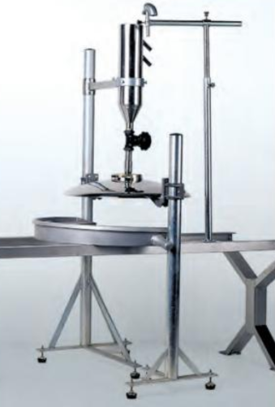.

Se busca reemplazarla por una esmaltadora de filera o velo que permite, mediante el control de la bomba y la aspersión, esmaltar más piezas en menor tiempo. Por esto se seleccionó la esmaltadora MASTERFALL de la compañia italiana Airless Italia, esta esmaltadora mediante sus roceadores permite la aplicación más rápida del esmalte llegando a un ritmo de producción de aproximadamente 30 baldosas por minuto. También permite mediante el controlador de flujo automático Controlflux la repetibilidad.

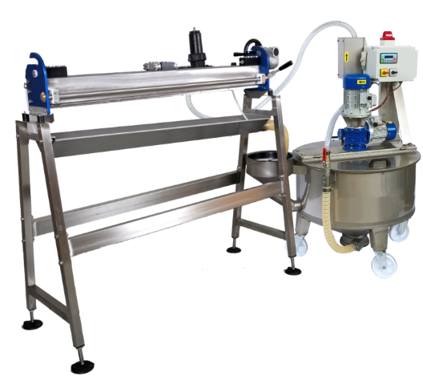.

## EDT 
Con el fin de conocer a fondo el proceso de producción de baldosas e identificar aquellas partes del proceso a mejorar y así optimizar la línea de producción se crea el EDT (Figura 3)orientado a la programación y entregables:

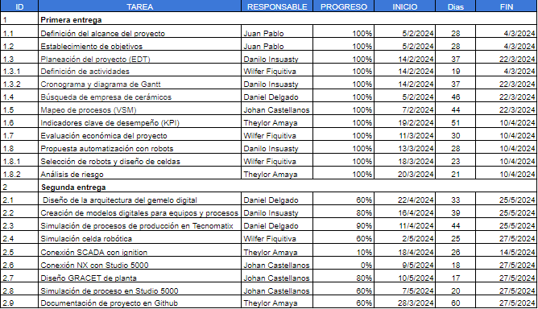.

### Figura 3 EDT

En el cual se muestra el cronograma de actividades y responsables de cada una de las actividades en la primera fase de entrega el cual es como una fase investigativa y argumentativa del proceso de producción, que  nos lleva hacia la identificación de la estación de trabajo que mediante nuestra propuesta de valor se busca optimizar mediante la automatización del proceso.

.

### Figura 4 diagrama de Gantt.

En el diagrama de Gantt se muestra la trazabilidad cronológica del desarrollo de sus actividades desde la fecha de inicio hasta la fecha de entrega.

##  3. Gestión de Producción y Automatización

### Horarios Operarios

### VSM (Actual)

Para una planta de una línea con capacidad de modificar sus parámetros para adaptarla a 3 posibles productos, consta de una línea de procesos como se presenta en:

%20V2.png)

### VSM (Propuesta)

Según las observaciones realizadas mediante las simulaciones y el análisis de la planta actual, se logró divisar que el principal cuello de botella se encuentra en la parte de revisión o clasificación, y en la parte de embalaje y paletizado. En base a esto, se propone el siguiente Mapa de flujo de valor (Value Stream Map):

%20V2.png)

## 4. Industria 4.0 en la Automatización

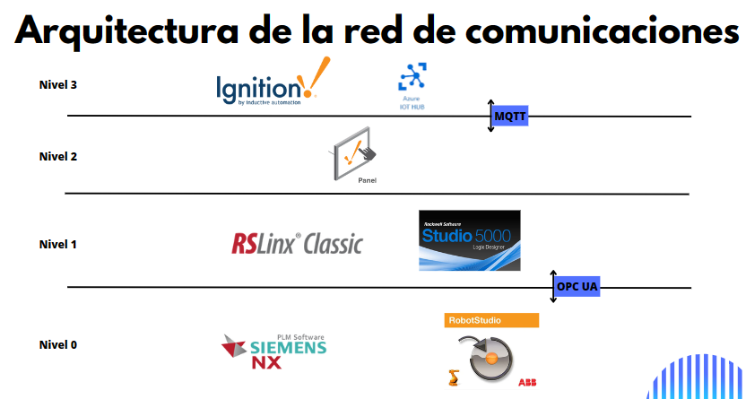

## Planeación del Proyecto

- Cronograma del proyecto realizado en alguna herramienta de software como CRM Bitrix24, Microsoft Project o alguna herramienta de planeación de proyectos. Es importante actualizar el cronograma en caso de cambios.

## 5.Evaluación Económica de Proyectos

### Costos de desarrollo
Cabe recordar que se realizó un pronostico de producción de 700.000 m2 mensuales y al producir unicamente 3 referencias del mercado tenemos que:

- Referencia de 60x60cm: Se produce un 40% de la estimación de producción mensual 
- Referencia de 60x31cm: Se produce un 25% de la estimación de producción mensual 
- Referencia de 45x45cm: Se produce un 35% de la estimación de producción mensual 

Teniendo como referencia la cantidad e masa que contiene cada metro cuadrado, se determinó que se producen mensualmente 9192.13 toneladas de materia prima ($8,842,500,996)

### Costos operativos
Los principales gastos mensuales operativos corresponden a la energía ($5,189,065,581), salarios ($399,126,000) y el arriendo mensual de la planta ($385,000,000).

### Costos de instalación
El proyecto de automatización de producción de baldosas cerámicas, se requiere una inversión inicial de $1,626,968,000. Esta inversión corresponde a la nueva maquinaria especial para automatizarse, el diseño de una celda robótica para el paletizado y una pequeña inversión para la adecuación del espacio para su instalación

### Marketing y ventas

Esperamos generar ingresos anuales de $22,106,252,489 a lo largo del proyecto. Para esto nos guiaremos de mercancía de cerámica para la venta en almacenes de construcción. Las referencias que manejaremos se pueden vender en un valor menor a la mitad de la venta de los distribuidores directamente al cliente consumidor.

Durante el primer mes, incurriremos en un costo operativo negativo debido a la inversión inicial y los gastos operativos, en donde la producción parará completamente mientras se realiza la instalación de equipos y su respectiva remodelación. A partir del segundo mes, esperamos ingresos mensuales de $1,842,187,707 contra costos operativos de $1,587,557,715, resultando en un flujo de efectivo neto positivo de $254,629,993 mensuales. Con estos flujos de efectivo, calculamos un Valor Presente Neto (VPN) de $87,248,857 y una Tasa Interna de Retorno (TIR) del 5%. Según nuestras proyecciones, recuperaremos nuestra inversión inicial en aproximadamente 22 meses.

## 6.Análisis de mercado

En Colombia, la industria de la producción de cerámicos enfrenta un panorama complejo para el año 2024. 

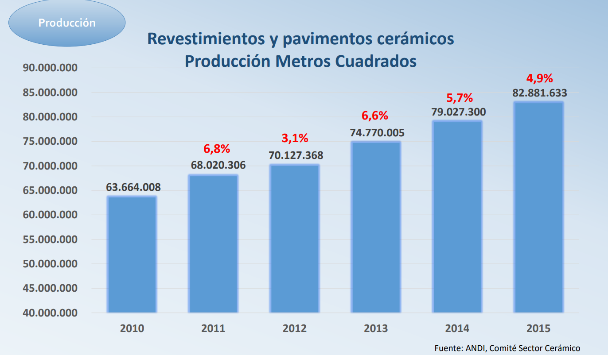

Segun la [ANDI](https://www.andi.com.co/Uploads/LaIndustriaCeramicaDeColombia.pdf), durante el periodo comprendido entre 2010 y 2015, se registró un crecimiento anual estimado del 4.6%, mientras que en 2019 se experimentó un notable aumento del 13.8% respecto al año base de 2015, alcanzando una producción de 94'319.298 metros cuadrados. Sin embargo, la irrupción de la pandemia de COVID-19 en 2020 impactó negativamente en la producción, ocasionando una disminución promedio del 5%. 

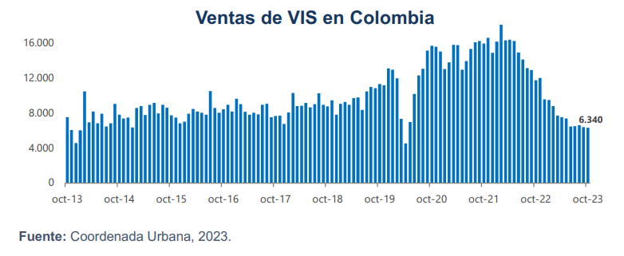

Además, en un nuevo informe de la [ANDI](https://www.andi.com.co/Uploads/Balance%202023%20Perspectivas%202024.pdf), el sector de la construcción ha sufrido una notable caída del 46% en sus ventas desde el año 2020, influenciada por los factores del mercado inmobiliario y las tasas de interés. Este contexto desafiante se ve reflejado en las ventas actuales, que se asemejan a las cifras reportadas en 2013, evidenciando una situación de incertidumbre en el mercado de cerámicos.

Si tomamos como base una línea de producción con prensa trabajando 3 turnos de 8 horas, 24 dias al mes durante los doce meses con una eficiencia del 80%, se tiene un estimado de producción de 15.482.600 metros cuadrados equivalente a un 20.7% de la producción total nacional.

## 7. Modelo CANVAS de negocios

## 8. Celda de Manufactura Robotizada

## 9. Propuesta de automatización

1. Se propone la implementación de un sistema de control de calidad automatizado en el proceso de clasificación de baldosas cerámicas. Este sistema empleará tecnología de visión artificial y clasificación óptica para examinar minuciosamente cada baldosa y separarlas de acuerdo con sus características y niveles de calidad.
Actualmente, el proceso de clasificación es realizado de manera manual por operarios. Sin embargo, esta metodología presenta limitaciones en cuanto a la capacidad de mantener una precisión constante y una velocidad de clasificación óptima a lo largo del tiempo. Los seres humanos tienden a fatigarse, lo que puede resultar en errores y variaciones en la calidad de la clasificación.
La implementación de la máquina de control de calidad automatizada permitirá superar estas limitaciones, mejorando significativamente la eficiencia y el rendimiento general del proceso de producción de baldosas cerámicas.
2. Con el objetivo de optimizar el proceso de esmaltado y lograr un acabado de mayor calidad, se implementarán mejoras tecnológicas que aumentarán la eficiencia y permitirán una aplicación más uniforme y controlada del esmalte. Se planea adoptar equipos de esmaltado automatizados que reemplazarán el método actual.
En la actualidad, el esmaltado se realiza mediante una máquina de esmaltado por campana, la cual presenta limitaciones en cuanto a la uniformidad y el control del proceso. Para superar estas deficiencias, se propone sustituir esta máquina por una de esmaltado por velo con controlador.
Este nuevo equipo automatizado permitirá una aplicación más precisa y homogénea del esmalte sobre la pieza, garantizando un acabado de mayor calidad y consistencia. Además, al contar con un sistema de control integrado, se podrán ajustar y monitorear los parámetros del proceso de manera más eficiente, optimizando el uso de materiales y reduciendo el desperdicio.
3. En el proceso de paletizado, la tarea manual presenta varias desventajas que pueden impactar negativamente en la eficiencia y precisión. La capacidad limitada de los trabajadores para manipular grandes volúmenes de baldosas puede conducir a errores y variaciones en la disposición de las piezas sobre los palets.
Por ello, se propone incorporar una celda robótica automatizada para el paletizado, lo cual conllevará mejoras significativas. Los robots industriales poseen la capacidad de manejar grandes cantidades de baldosas de forma rápida y precisa, optimizando su acomodo en los palets y reduciendo la posibilidad de errores propios de la operación manual.

#### Hoja ruta - Celda robótica

- Análisis para justificar una robotización y el valor agregado del uso del robot en el proceso.
- Diseño de celda robotizada considerando relación con espacio, flujo de producto, interacción con personal, seguridad funcional y agarre del robot.
- Modelo de la celda en RobotStudio con el diseño, programación y animación de movimientos. Un video que contenga una simulación de movimientos en la celda.
- Identificación de peligros y gestión del riesgo, análisis de riesgos inicial, medidas propuestas para mitigación del riesgo y evaluación de riesgos con las medidas aplicadas.
- 
  ### 10. DISEÑO DE CELDA ROBÓTICA

  Para el diseño de la celda robótica se parte de considerar el tamaño de las cajas y el peso de cada una de las referencias las cuales son:
    •	60x31x80 cm, 27.5 Kg.
    •	60x60x42 cm, 17.5 Kg Cerámico de interiores.
    •	45x45x60 cm, 20.8 Kg.  Gres porcelanico.
Teniendo en cuenta que el suministro de baldosas a la zona de paletizado se hace en bloques de dos cajas, podemos determinar la capacidad máxima de carga a manipular (55KG) por el robot basados en la de mayor peso.

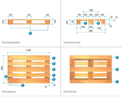.

Por otra parte, basado en información de referencia de las empresas de baldosas encontramos que ellos suelen usar palets que cumplen la norma europea; eruopalet o EPAL estándar de 1200x800 mm figura 10.1, con el cual teniendo en cuenta las dimensiones y el peso de las cajas de las baldosas determinamos tanto la cantidad como la distribución para ser paletizado según la referencia. Para el caso de la caja de baldosa 60x31x80cm, se hace el respectivo modelado de la distribución y cantidad de cajas en el palet, figura 10.2.

  .

Este modelado nos permite saber la distancia más lejana en la que se debe ubicar una de las cajas, de tal manera que ya conociendo el peso máximo a manipular y el alcance máximo por medio del catálogo del fabricante de robots ABB hacemos la selección del robot que se adapta a nuestras necesidades, el cual es el robot IRB570, figura 10.3 que tiene una capacidad de carga de hasta 70Kg con un radio máximo de envolvente de 2.3 metros ficha técnica anexo 3.

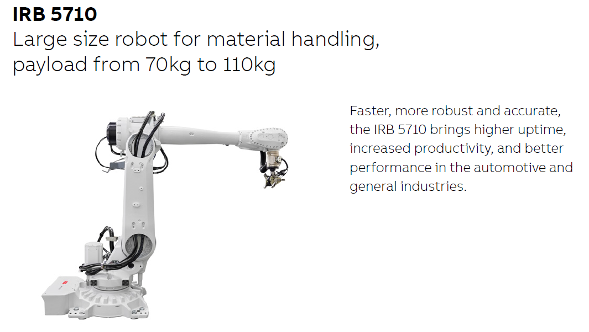.

Una de las particularidades de seleccionar el robot de 6 grados de libertad es la posibilidad de poder manipular las cajas que vienen en sentido horizontal y ubicarlas en el palet de manera vertical con eso ahorramos tiempo y eliminamos un paso en el alinea de proceso al tener que cambiarlas de sentido antes de poetizar.
Por otra parte, con el fin de optimizar el tiempo en paletizado se propone hacer alimentación de estibas automáticamente, de tal manera que los palets se encuentras en columna vertical y una vez se requiere son alimentados por una banda transportadora la cual fue es modelada figura 10.4 ya que requiere unas condiciones especiales de carga y movimiento para transportar el palet tanto vació como cargado.

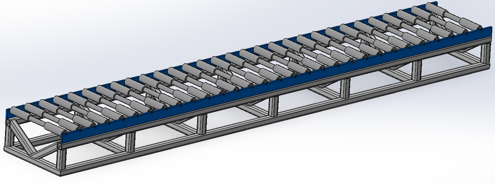.

La celda robótica comprende doble alimentador de estibas uno derecho y uno izquierdo los cueles son modelados y se muestran en la figura 10.5 con el fin de que mientras el robot paletiza una estiba y termina pueda ir a seguir paletizando la estiba que se encuentra en la banda transportadora contraria mientras la estiba cargada es movida hacia la salida y se alimenta una nuevo palet vació.

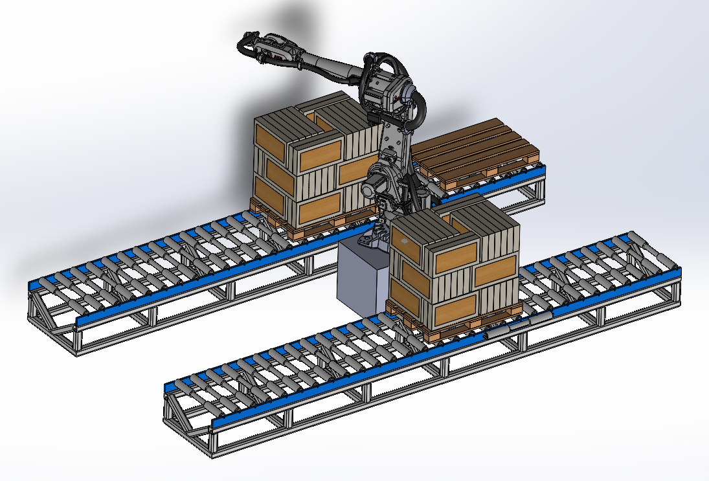.

Una vez modelado se hace la implementacion de la celda robótica en RobotStudio figura 10.6 el cual se coloca la banda de alimentación de producto y las bandas de alimentación de estibas automáticamente.

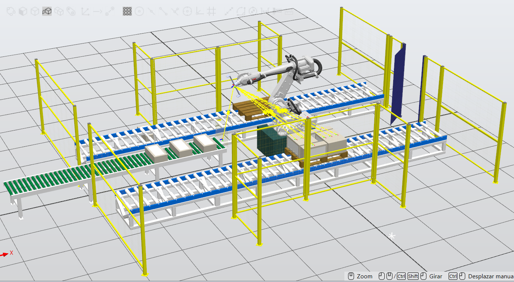.

En términos de seguridad cuanta con un encerramiento en malla que delimita el área de trabajo, existen 4 puntos de carga y descargue para el montacargas los cuales en la entrada tienen cortinas de seguridad.

El único ingreso a la celda robótica par ale personal autorizado se hace por medio de una puerta en la parte posterior la cual también cuenta con interlock para seguridad que nadie vaya a ingresar mientras la celda está en operación.

En cuanto a la programación de la celda en RobotStudio se hizo mediante el  uso de smartcomponent figura 10.7 el cual permite trabajar con bloques de programación con el fin de poder llevar una lógica que se permite interconectar de manera efectiva las entradas y salidas de los equipos que intervienen en la celda.

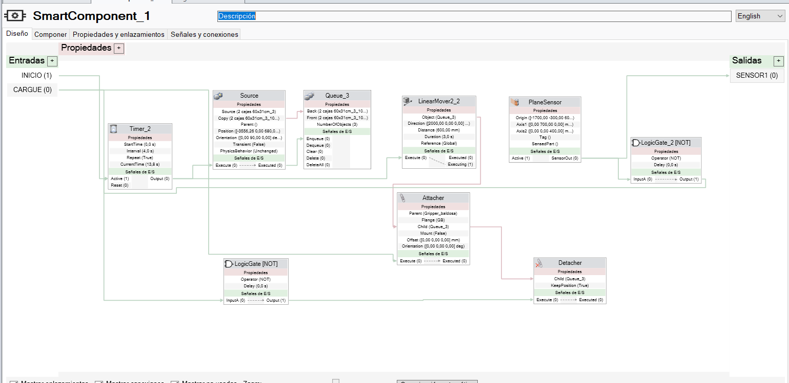.

La automatización de la celda parte de que las bandas transportadoras sean automáticas, para el caso de la banda transportadora que alimenta las cajas se implementa un timer el cual genera baldosas cada 10 segundos.
La banda se detiene una vez al final una caja llega al final de la banda y es detectada por un sensor de presencia, el cual envía una señal y activa la rutina de cargue de la caja, transporte al palet y descargue de la caja, retornando a su punto de inicio nuevamente a la espera de un nuevo producto para transportar.
Una vez se detecta una nueva caja en la banda repite el ciclo con la diferencia que cambia la ubicación de destino donde dejara la caja y así lo repite una y otra vez el ciclo hasta completar el número de cajas total en el palet.
Una vez lleno el palet de un lado e robot inicia paletizado en la banda transportadora opuesta mientras se transporta el palet que se completó y se ubica un palet vació.
Así se mantiene el proceso cíclicamente y se detendrá hasta que el controlador de la señal de parada se active un sensor de seguridad y existiendo alguna vulneración al espacio de la celda.

#### Consideraciones de seguridad (Matriz de seguridad)

### 11. Digital Factory

  

Hemos desarrollado un modelo tridimensional de las instalaciones de la planta de cerámica. En este modelo se muestra la distribución propuesta de las nuevas máquinas y equipos que formarán parte del proceso de automatización. Esta nueva disposición tiene como objetivo principal mejorar y optimizar los flujos de producción actuales, incrementando la eficiencia operativa de toda la planta. El modelo 3D permitirá visualizar de manera precisa la ubicación y el funcionamiento integrado de cada una de las máquinas automatizadas planificadas para su posterior instalación en las distintas áreas de la fábrica.

  

Posteriormente, se importó el modelo 3D a Siemens NX, en este entorno, se configuraron los parámetros físicos del modelo, incluyendo las propiedades de los objetos, las uniones y restricciones cinemáticas, así como la definición de sensores y actuadores que emularán el funcionamiento real de la planta. 
Como parte inicial de la programación del sistema de control, se implementó una rutina de operación en el editor de secuencias de Siemens NX. Esta rutina representa el flujo de procesos que se llevará a cabo en la planta automatizada. En el video adjunto, se puede observar la simulación de dichas rutinas previamente definidas.
El siguiente paso será traducir estas secuencias de operación modeladas en NX al código de programación del controlador lógico programable (PLC) que gobernará el sistema de automatización real. La simulación previa en el entorno virtual facilita esta tarea de implementación, al brindar una representación dinámica y funcional que permite validar y ajustar la programación antes de su puesta en marcha definitiva.

  

Posteriormente, se estableció una conexión entre el software TIA Portal de Siemens y el entorno de simulación Siemens NX. Esto permitió comprobar el funcionamiento del controlador lógico programable (PLC) de manera virtual, previo a su implementación física real.
La conexión se realizó de forma exitosa, logrando vincular el PLC virtual con el modelo 3D de la planta. Como prueba inicial, se programó y simuló la operación de la banda transportadora que conecta el silo de almacenamiento con la prensa de producción.
Si bien la intención original era implementar la rutina completa de toda la planta automatizada durante esta fase, debido a limitaciones de tiempo, se propone continuar esta tarea utilizando el software Studio 5000 de Rockwell Automation. En este entorno ya se desarrolló un programa de control general, siguiendo la lógica y secuencia de operaciones planteada inicialmente en Siemens NX. Ver en el siguiente video:

  

### Controladores Industriales (PLC)
#### Hoja de ruta sensorica, Ladder y PLC

1. Planteamiento de los sensores a usar:
   - Proceso: Se realizará un estudio para determinar qué sensores usar en la planta. Esto se basará en el nivel de detalle deseado, la disposición de la planta, la automatización planeada y la producción deseada.
   - Requisitos: Disposición de la planta (nivel de detalle medio en qué máquinas se usan, cuántas y cómo funcionan), automatización planeada (énfasis medio en producción, funcionamiento de las máquinas, desplazamiento de productos y cantidad según el tiempo).

2. Planteamiento de los diagramas de flujo por maquinaria según el método paso a paso:
   - Proceso: Se realizará un diagrama de flujo por método paso a paso para definir estados de la máquina y sus activadores. Esto representará el funcionamiento de cada máquina y los sensores asociados para modificar los estados de la máquina.
   - Requisitos: Sensores planteados, máquinas y su funcionamiento.

3. Estructuración de los diagramas de flujo enfocados en GRAFCET:
   - Proceso: Se reestructurarán los diagramas de flujo y se enfocarán en el estilo GRAFCET para lograr una mejor integración y comprensión del código.
   - Requisitos: Diagramas de flujo método paso a paso.

4. Desarrollo de los códigos ladder:
   - Proceso: Con base en el esquema enfocado en GRAFCET, se plantearán los esquemas en Studio 5000. Se usará subrutinas y saltos (JSR) para implementar un código principal (rutina main) en un PLC simulado con Logix Emulate, con la intención de simular el PLC virtual.
   - Requisito: Diagrama enfocado en GRAFCET.

5. Según necesidad, selección de los PLC DCS o PAC a usar:
   - Proceso: Se investigarán PLC capaces de cumplir con los requisitos y se seleccionarán los correspondientes, basándose en los requisitos del PLC, análisis de tiempos de rutinas, sensores seleccionados y análisis de potencia para los complementos.
   
6. Análisis de seguridad:
   - Proceso: En base a los PLC elegidos, el código y el proceso, se realizará una consideración para sistemas redundantes y seguros con sensores y actuadores enfocados en la seguridad del entorno.

7. Reestructuración enfocada en seguridad y presupuesto:
   - Proceso: Si se requieren modificaciones basadas en la seguridad junto con consideraciones económicas, se discutirán estas modificaciones. Se espera que sean menores.
   - Requisitos: Análisis de seguridad y apoyo del análisis económico.

#### Análisis y Esquemas Grafcet

Para la implementación del controlador industrial se realizó un estudio de las etapas por las que pasa un producto en las diferentes estaciones y las dependencias. Partiendo de la línea de producción de forma secuencial, incluyendo medios de transporte, tenemos:

Partiendo de esta línea de producción, tenemos las maquinarias por las que pasa cada etapa del producto. Para el análisis de cada etapa, partimos del hecho de que cada etapa es independiente de las otras. Esto significa que ningún estado de las otras etapas debe condicionar la etapa actual, salvo por los sensores de posición de material que condicionan la entrada, salida y operación de cada etapa. Por lo tanto, realizamos un análisis conceptual de las posibles señales y los posibles sensores requeridos para esta etapa:

En este desglose simple de señales por maquinaria, incluyendo maquinarias de transporte, podemos empezar con el análisis por estación de trabajo, es decir, maquinarias sin incluir Bandas transportadoras. Para esto, partimos de que cada máquina tiene acceso a máximo 2 maquinarias de transporte, una de ingreso y una de salida. Por lo tanto, tenemos para las máquinas:

- Silo de almacenamiento de materia prima:
En esta etapa, partimos de que el silo suministra materia prima mediante un dispensador, el cual se activa mediante un temporizador. Finalizado ese tiempo, se activa el transporte de salida, se detectan los sensores de salida y se repite el proceso de forma continua. Con lo que tenemos:

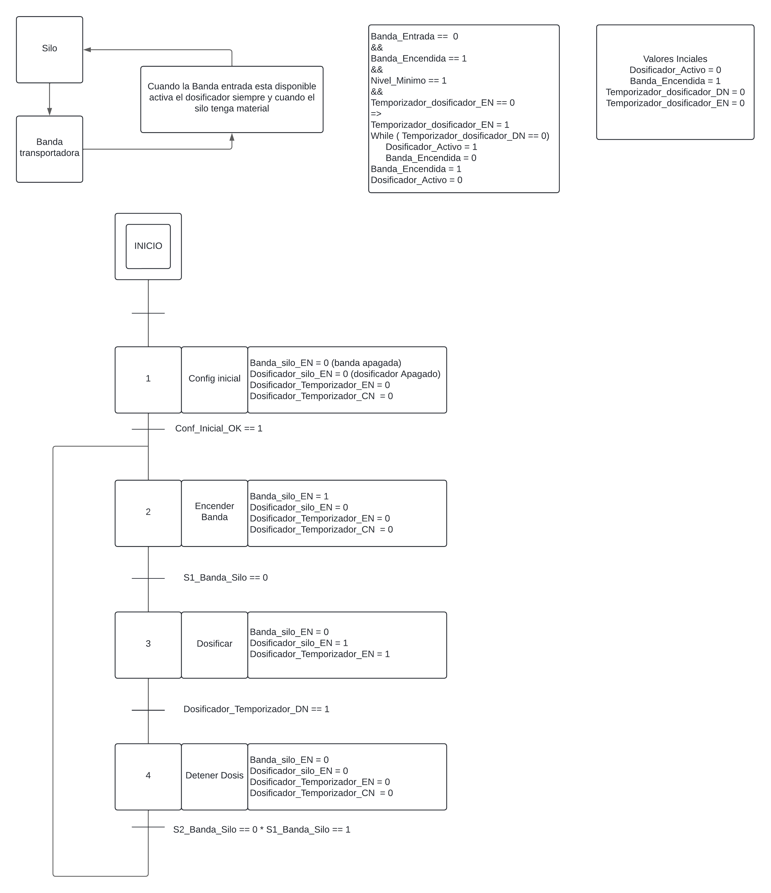

- Prensa de materia prima:
En esta etapa, tomamos la materia prima, la cual es un polvo o una mezcla granular que ingresa en múltiples etapas de suministrado. Por lo que para este paso se hace uso de un contador que cuenta cuántas veces ha ingresado una tanda de materia prima a la prensa antes del prensado. Luego se realiza el prensado, que se mide en tiempo, por lo cual el prensado posee un temporizador. Al finalizar, tenemos la salida de la materia prima y el proceso vuelve a empezar desde el reinicio del contador:

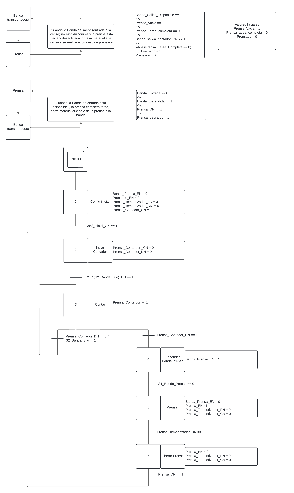

- Secado de material comprimido:
En esta etapa, es necesario retirar la humedad presente en la materia prima comprimida. Para esto, se usa un secador. En este caso, se usa un secador continuo lineal en el cual la materia prima comprimida entra en un horno con temperaturas bajas y corto tiempo. Dentro del horno, hay bandas transportadoras que continuamente desplazan la materia comprimida desde la entrada a la salida. Este proceso es más simple porque solo se enciende el horno, se obtiene la temperatura objetivo e ingresa continuamente material. Por lo tanto, tenemos:

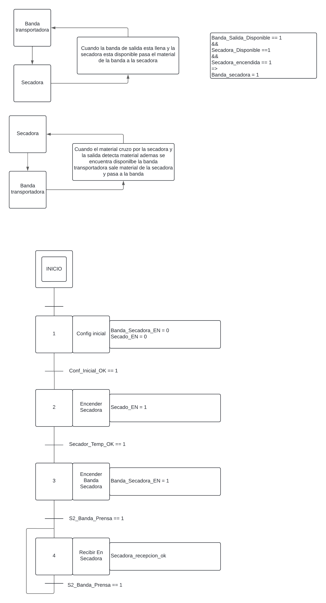

- Engobe de baldosa:
En esta etapa, tenemos una máquina que recibe la baldosa, aplica una capa de engobe a cada baldosa. Esta etapa recibe el material, activa el proceso, termina el proceso de aplicación de engobe, luego se detiene el proceso, reactiva el paso de la baldosa a la siguiente etapa, recibe otra baldosa sin engobe y vuelve a hacer el proceso. Con lo que tenemos:

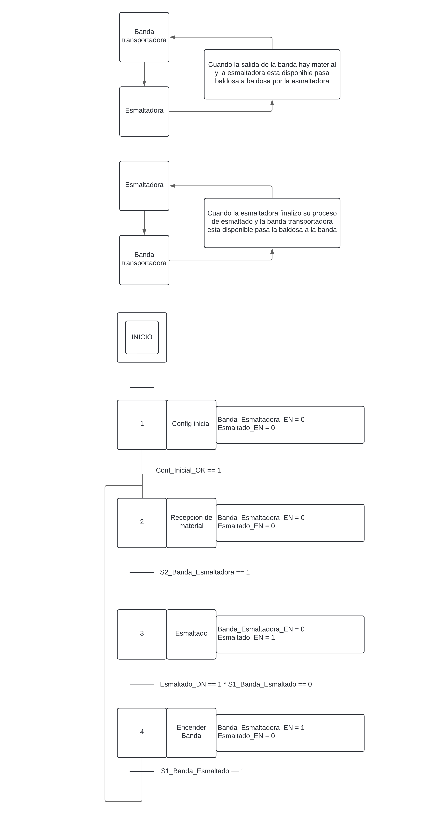

- Impresión o aplicación de patrón de color:
En esta etapa, tenemos la aplicación del color mediante la impresora. Esta etapa, si bien es un proceso diferente, su funcionamiento secuencial es equivalente al de la esmaltadora. Por lo tanto, tenemos un esquema similar:

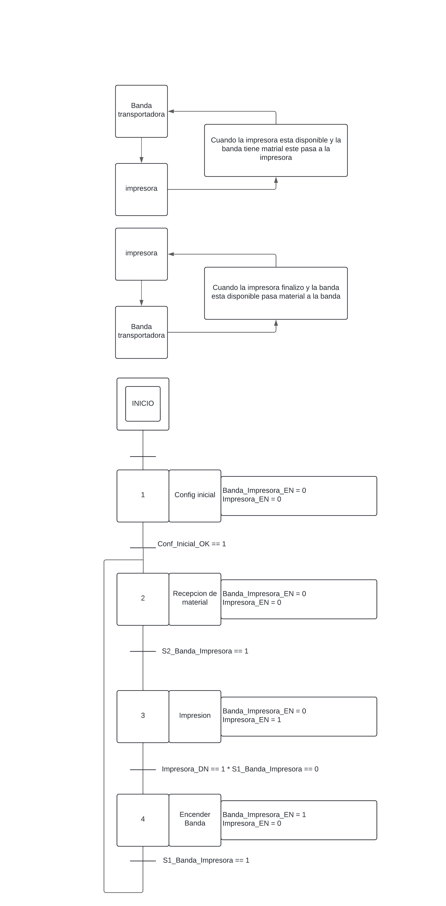

- Esmaltado de baldosa:
En esta etapa, aplicamos la última capa de material sobre la baldosa, este es el esmalte. Este proceso es exactamente el mismo que el de engobe, ya que se realiza con la misma maquinaria o maquinarias similares. Por lo tanto, tenemos el mismo esquema:

- Cocción de Baldosa:
Esta etapa calienta la baldosa cerámica a entre 900°C y 1200°C. Sin embargo, el proceso es el mismo que el realizado durante el secado, por lo que su esquema es muy similar al del secador:

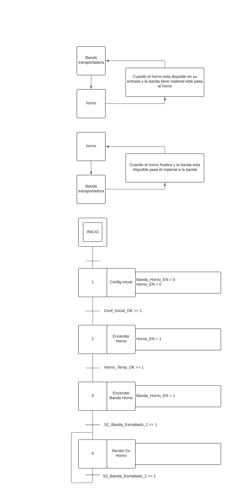

#### Diagramas Ladder:
En esta etapa, haciendo uso de los esquemas Grafcet y su sistema de etapas, se realizaron esquemas ladder secuenciales activados por y detenidos por secuencias. En este proceso tenemos:

- Main Program:
Como planteamos al inicio, es necesario que las máquinas sean independientes de los estados de las otras. Por lo tanto, para el esquema ladder partimos de un Main Program que ejecuta los subprogramas de cada maquinaria:

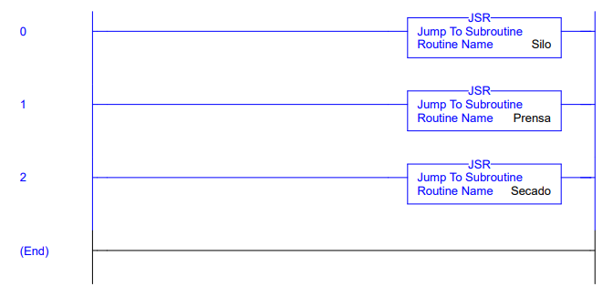

- Silo SubRutina:
Para la máquina del silo, partimos del esquema en Grafcet previamente descrito y realizamos un código en dos secciones. La primera es la sección de estados, en la cual activamos y desactivamos los bits de memoria que se usan en cada estado de la máquina. En la segunda parte del código, tenemos la etapa de selector de estados. Esta etapa se encarga de seleccionar un estado de la maquinaria según corresponde con el conjunto de señales que permiten el salto de puntero en Grafcet. Partimos de una condición inicial para cuando se enciende la maquinaria y luego pasamos a los estados de trabajo indicados con el nombre de la maquinaria y el número del estado de Grafcet:

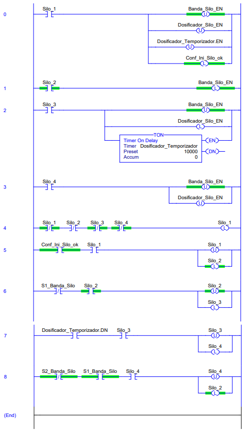

- Prensa SubRutina:
Para esta máquinaria, tenemos un esquema con una bifurcación OR que nos permite decidir entre el estado de conteo y el estado de prensado. Esta bifurcación de conteo hace uso de un estado auxiliar debido a que para poder salir y volver a entrar en un estado para el esquema en ladder no es tan sencillo de programar, por lo que se hace uso de un estado temporal para permitir ese bucle de entrada y salida del mismo estado. Para la salida en OR, hay un bit de memoria que al activarse o no permite decidir entre un estado u otro:

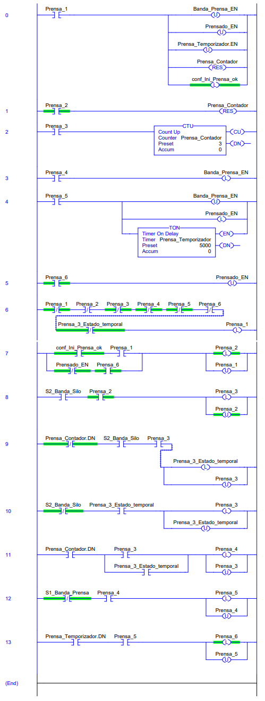

- Secadora SubRutina:
Para el estado de la Secadora, tenemos un esquema simple con el último estado en bucle. Como en el estado final es un bucle sobre sí mismo, hacemos uso de un estado auxiliar para permitir la salida y reingreso sobre el mismo estado:

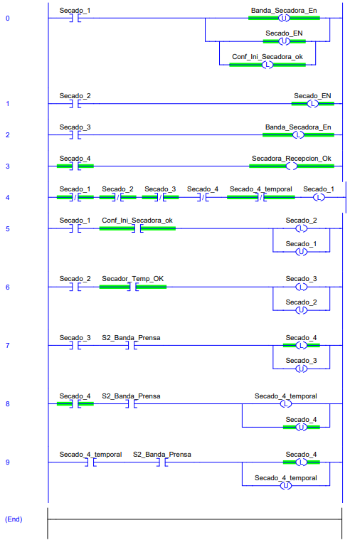

- Otros diagramas:
Para el esquema del horno, tenemos que su similitud con el esquema del secador nos permite usar el mismo esquema pero con sus respectivos bits de memoria. Para el esquema de la impresora y los de las esmaltadoras, podemos partir del esquema del silo con sus respectivos bits de memoria gracias a su similitud.

- Video de funcionamiento en Studio 5000 con Logix Emulate:
En este video podemos observar cómo las 3 lógicas funcionan en el código, haciendo uso de entradas simuladas al forzarse en el PLC virtual:

https://github.com/Tecnomotion-UNAL2024-1/PROYECTO_APM/assets/61796945/a15123dc-729b-4c9a-ae6b-af3e5c350037

### Comunicaciones

- Descripción de las comunicaciones utilizadas para el proyecto, identificando protocolos, canales, niveles de la pirámide de automatización donde son utilizadas.

### SCADA

- En GitHub, colocar el enlace en YouTube del video de la interfaz en el SCADA alojado en la nube supervisando las diferentes variables que se obtienen de la comunicación OPC y MQTT.
- Detalles de la configuración del SCADA, incluyendo la comunicación OPC entre Controlador Industrial e Ignition Local 1, así como la comunicación MQTT entre Ignition Local 1 e Ignition Nube. Se describirá también la comunicación OPC entre Siemens NX e Ignition Local 2, y entre otras plataformas industriales con Ignition Local 3, todas comunicándose por MQTT con Ignition Nube.

Para visualizar y operar el SCADA alojado en la nube, se proporcionará la dirección IP pública correspondiente.
